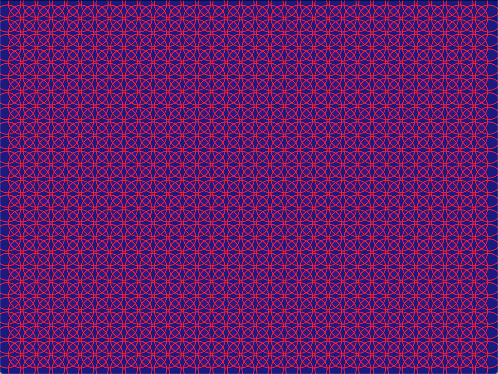
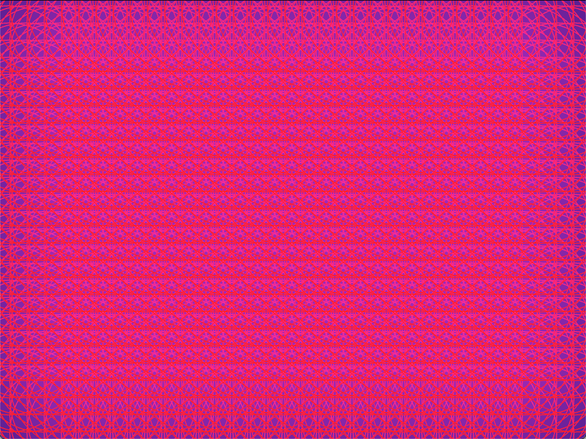

# simple-hive
A short but sweet animation with an evolving honeycomb pattern

### Quick start

```bash
cargo build --release
cargo run -r
```

### Visulisations







### Inspiration and Further Reading

- [Inspired by this post on r/GeometryIsNeat by u/Danile2401](https://www.reddit.com/r/GeometryIsNeat/comments/zzj38u/circles_growing_in_place/)
- [Found in Encyclopedia of Mathematics 2nd Edition](https://books.google.com.au/books?id=D_XKBQAAQBAJ&pg=PA1079&redir_esc=y#v=onepage&q&f=false)
- [Flower of Life : MathWorld](https://mathworld.wolfram.com/FlowerofLife.html)

## License and Contribution

MIT License Applies.
Contributions welcome as git-branches.
Thank you.
